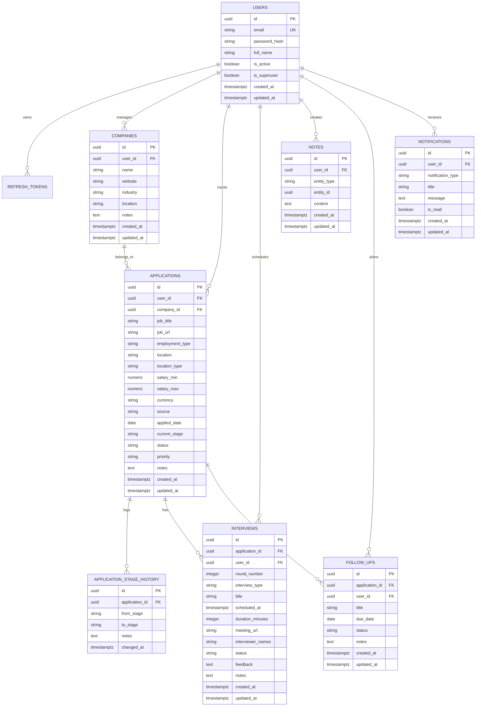
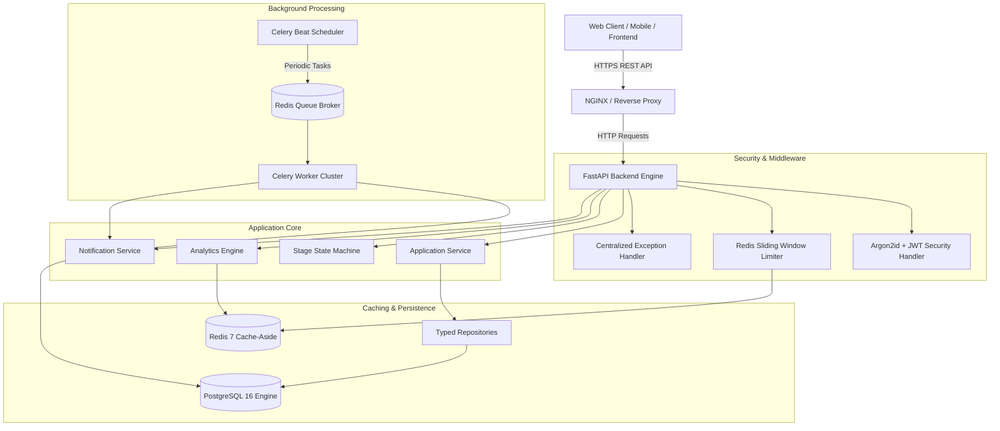
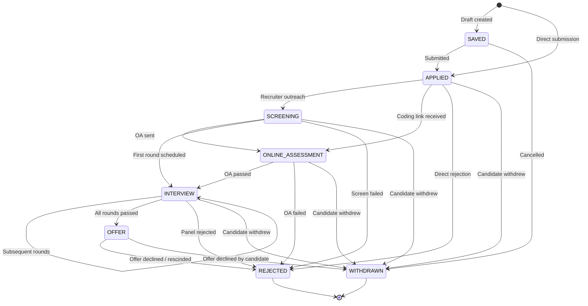

# DevTrack Backend API

> **Enterprise-grade Developer Productivity & Job Application Tracking Backend API**  
> Built with Python 3.12+, FastAPI, SQLAlchemy 2.0 (Async), PostgreSQL, Redis, and Celery.

[](https://github.com/ashucfx/devtrack-backend/actions/workflows/ci.yml)
[](https://www.python.org/)
[](https://fastapi.tiangolo.com)
[](https://www.sqlalchemy.org/)
[](https://www.postgresql.org/)
[](https://redis.io/)
[](https://docs.celeryq.dev/)
[](https://github.com/astral-sh/ruff)

---

## Table of Contents

1. [Architecture Overview](#architecture-overview)
2. [Database Schema & Entity Relationship Diagram](#database-schema--entity-relationship-diagram)
3. [Key Engineering Highlights](#key-engineering-highlights)
4. [System Architecture Diagram](#system-architecture-diagram)
5. [Recruitment Finite State Machine (FSM)](#recruitment-finite-state-machine-fsm)
6. [API Reference & Endpoint Map](#api-reference--endpoint-map)
7. [Local Development Setup](#local-development-setup)
8. [Docker & Container Orchestration](#docker--container-orchestration)
9. [Background Workers & Scheduled Tasks](#background-workers--scheduled-tasks)
10. [Test Suite & Quality Assurance](#test-suite--quality-assurance)
11. [Design Decisions & Engineering Tradeoffs](#design-decisions--engineering-tradeoffs)

---

## Architecture Overview

DevTrack is a multi-tenant backend engine engineered for high-throughput job tracking, recruitment pipeline management, and developer career productivity.

The system is designed following strict domain-driven layering:
- **API Transport Layer (`app/api/`)**: FastAPI routers, dependency-injected security, payload validation, and centralized exception mapping.
- **Service Domain Layer (`app/services/`)**: Core business logic, deterministic state machines, transaction boundaries, and cache-aside invalidation triggers.
- **Data Access Layer (`app/repositories/`)**: Generic typed SQLAlchemy 2.0 repositories handling multi-tenant scoping and SQL-level aggregations.
- **Background Worker Subsystem (`app/workers/`)**: Celery distributed task queue backed by Redis with periodic Celery Beat cron scheduling.
- **Caching & Rate Limiting (`app/core/`)**: Connection-pooled async Redis manager, sliding-window request limiters, and response caching.

---

## Database Schema & Entity Relationship Diagram



---

## Key Engineering Highlights

- **Strict Multi-Tenant Scoping**: All database queries enforce `user_id == current_user.id`. Cross-tenant lookup attempts return `404 Not Found` (rather than `403 Forbidden`) to eliminate resource enumeration vectors.
- **Cryptographic Security**: Password hashing powered by **Argon2id** (memory-hard, resistant to GPU/ASIC cracking). JWT tokens feature unique UUIDv4 `jti` claims for rotation and immediate revocation tracking.
- **Deterministic Stage Machine**: Validated stage transition matrix preventing impossible stage leaps (e.g., jumping from `SAVED` straight to `OFFER`), backed by an append-only `application_stage_history` ledger.
- **Dynamic Database-Level Search & Pagination**: Application listings feature multi-predicate ILIKE filtering, salary range filtering, stage multi-selection, and date-range constraints executed inside PostgreSQL queries.
- **SQL-Level Aggregation Analytics**: Funnel conversion, categorical distributions, stage velocity durations, and dashboard summary KPIs computed via SQL aggregations with zero in-memory iteration overhead.
- **Redis Cache-Aside & Event Invalidation**: Dashboard metrics cached in Redis with sub-second retrieval times and automatic cache invalidation upon any application, company, or interview mutation.
- **Distributed Background Workers**: Celery workers running on Redis message broker with scheduled Beat cron checking for overdue follow-ups and interview reminders.

---

## System Architecture Diagram



---

## Recruitment Finite State Machine (FSM)



---

## API Reference & Endpoint Map

All routes are prefixed with `/api/v1`.

### 1. Authentication (`/api/v1/auth`)
| Method | Path | Summary | Auth Required | Rate Limited |
| :--- | :--- | :--- | :---: | :---: |
| `POST` | `/auth/register` | Register new account & return tokens | No | Yes (3/min) |
| `POST` | `/auth/login` | Authenticate with credentials | No | Yes (5/min) |
| `POST` | `/auth/refresh` | Rotate refresh token for new access token | No | No |
| `POST` | `/auth/logout` | Revoke active refresh token | No | No |

### 2. User Management (`/api/v1/users`)
| Method | Path | Summary | Auth Required |
| :--- | :--- | :--- | :---: |
| `GET` | `/users/me` | Fetch authenticated user profile | Bearer JWT |
| `PATCH` | `/users/me` | Update full name or profile fields | Bearer JWT |
| `POST` | `/users/me/change-password` | Secure password change | Bearer JWT |

### 3. Companies (`/api/v1/companies`)
| Method | Path | Summary | Auth Required |
| :--- | :--- | :--- | :---: |
| `POST` | `/companies` | Create new company record | Bearer JWT |
| `GET` | `/companies` | List companies with search & pagination | Bearer JWT |
| `GET` | `/companies/{id}` | Get company by ID | Bearer JWT |
| `PATCH` | `/companies/{id}` | Update company details | Bearer JWT |
| `DELETE` | `/companies/{id}` | Delete company and cascade associations | Bearer JWT |

### 4. Job Applications (`/api/v1/applications`)
| Method | Path | Summary | Auth Required |
| :--- | :--- | :--- | :---: |
| `POST` | `/applications` | Create job application (idempotent) | Bearer JWT |
| `GET` | `/applications` | Multi-filter dynamic search & sort | Bearer JWT |
| `GET` | `/applications/{id}` | Get application details with company | Bearer JWT |
| `PATCH` | `/applications/{id}` | Update non-stage application fields | Bearer JWT |
| `POST` | `/applications/{id}/stage` | Execute validated stage transition | Bearer JWT |
| `GET` | `/applications/{id}/timeline` | Retrieve complete stage progression audit | Bearer JWT |
| `DELETE` | `/applications/{id}` | Delete application record | Bearer JWT |

### 5. Interviews (`/api/v1`)
| Method | Path | Summary | Auth Required |
| :--- | :--- | :--- | :---: |
| `POST` | `/applications/{id}/interviews` | Schedule interview round | Bearer JWT |
| `GET` | `/applications/{id}/interviews` | List interview rounds for application | Bearer JWT |
| `GET` | `/interviews/{id}` | Get interview round details | Bearer JWT |
| `PATCH` | `/interviews/{id}` | Update interview status or feedback | Bearer JWT |
| `DELETE` | `/interviews/{id}` | Delete interview round | Bearer JWT |

### 6. Polymorphic Notes (`/api/v1/notes`)
| Method | Path | Summary | Auth Required |
| :--- | :--- | :--- | :---: |
| `POST` | `/notes` | Create rich note attached to parent entity | Bearer JWT |
| `GET` | `/notes` | List notes by `entity_type` & `entity_id` | Bearer JWT |
| `DELETE` | `/notes/{id}` | Delete note | Bearer JWT |

### 7. Scheduled Follow-ups (`/api/v1`)
| Method | Path | Summary | Auth Required |
| :--- | :--- | :--- | :---: |
| `POST` | `/applications/{id}/follow-ups` | Schedule follow-up task | Bearer JWT |
| `GET` | `/applications/{id}/follow-ups` | List follow-ups for application | Bearer JWT |
| `GET` | `/follow-ups` | List all user follow-ups (`today`/`overdue`/`upcoming`) | Bearer JWT |
| `GET` | `/follow-ups/{id}` | Get follow-up details | Bearer JWT |
| `PATCH` | `/follow-ups/{id}` | Update follow-up or mark completed | Bearer JWT |
| `DELETE` | `/follow-ups/{id}` | Delete follow-up task | Bearer JWT |

### 8. Analytics Engine (`/api/v1/analytics`)
| Method | Path | Summary | Auth Required |
| :--- | :--- | :--- | :---: |
| `GET` | `/analytics/dashboard` | Key summary KPIs (Redis cached) | Bearer JWT |
| `GET` | `/analytics/funnel` | End-to-end recruitment funnel conversion | Bearer JWT |
| `GET` | `/analytics/breakdown` | Application distributions (stage, source, priority, location) | Bearer JWT |
| `GET` | `/analytics/velocity` | Average duration between stage transitions | Bearer JWT |
| `GET` | `/analytics/timeline` | Application submission trends over time | Bearer JWT |

### 9. Notification Inbox (`/api/v1/notifications`)
| Method | Path | Summary | Auth Required |
| :--- | :--- | :--- | :---: |
| `GET` | `/notifications` | List user notification alerts | Bearer JWT |
| `PATCH` | `/notifications/{id}/read` | Mark single notification as read | Bearer JWT |
| `POST` | `/notifications/read-all` | Mark all unread notifications as read | Bearer JWT |

---

## Local Development Setup

### Prerequisites
- Python 3.12 or 3.13
- PostgreSQL 16
- Redis 7

### 1. Clone Repository & Setup Virtual Environment
```bash
git clone https://github.com/ashucfx/devtrack-backend.git
cd devtrack-backend

python -m venv .venv
# On Linux/macOS:
source .venv/bin/activate
# On Windows (PowerShell):
.\.venv\Scripts\Activate.ps1
```

### 2. Install Dependencies
```bash
pip install --upgrade pip setuptools wheel
pip install -e ".[dev]"
```

### 3. Environment Configuration
Copy `.env.example` to `.env` and adjust database credentials if needed:
```bash
cp .env.example .env
```

### 4. Run Database Migrations
```bash
alembic upgrade head
```

### 5. Start Development Server
```bash
uvicorn app.main:app --reload --host 0.0.0.0 --port 8000
```
API Documentation will be available at:
- **Swagger UI**: `http://localhost:8000/api/v1/docs`
- **ReDoc**: `http://localhost:8000/api/v1/redoc`

---

## Docker & Container Orchestration

Run the complete production stack (FastAPI + PostgreSQL + Redis + Celery Worker + Celery Beat) with a single command:

```bash
docker compose up --build -d
```

Check service health:
```bash
docker compose ps
docker compose logs -f api
```

Tear down containers and volumes:
```bash
docker compose down -v
```

---

## Background Workers & Scheduled Tasks

Start Celery worker standalone:
```bash
celery -A app.workers.celery_app.celery_app worker --loglevel=info -c 4
```

Start Celery Beat scheduler:
```bash
celery -A app.workers.celery_app.celery_app beat --loglevel=info
```

Periodic tasks configured:
1. `check_overdue_follow_ups`: Scans pending follow-ups due on or before today and issues inbox alerts.
2. `check_upcoming_interviews`: Scans interviews scheduled in the upcoming 24 hours and generates reminder notifications.

---

## Test Suite & Quality Assurance

The codebase includes an exhaustive test suite with unit, integration, and security negative test scenarios.

### Run All Tests
```bash
pytest
```

### Run Tests with Coverage Report
```bash
pytest --cov=app --cov-report=term-missing --cov-report=html
```

### Code Formatting & Linting
```bash
ruff check --fix .
ruff format .
```

---

## Design Decisions & Engineering Tradeoffs

| Decision | Chosen Approach | Alternative Considered | Engineering Tradeoff / Rationale |
| :--- | :--- | :--- | :--- |
| **Password Hashing** | Argon2id (`argon2-cffi`) | bcrypt / PBKDF2 | Winner of PHC; provides superior resistance against GPU and side-channel attacks through memory hardness. |
| **Token Rotation** | RFC 7519 `jti` with single-use refresh token revocation in DB | Stateless JWT without revocation | Prevents replay attacks and enables instant user session revocation upon logout or refresh. |
| **Stage Transitions** | Deterministic Finite State Machine (FSM) Matrix | Unconstrained Enum update | Protects data integrity and prevents impossible status leaps, preserving accurate funnel analytics. |
| **Analytics Aggregation** | Pure SQL Aggregation (`GROUP BY`, `func.count`) | In-Memory Python calculation | Scales to millions of records with minimal server memory footprint by leveraging database index scans. |
| **Multi-Tenancy** | Row-Level Tenant Scoping (`user_id` on all tables) | Schema-per-tenant | Lower operational overhead and connection pool efficiency while ensuring strict logical isolation. |
| **Rate Limiting** | Redis Sliding-Window Log | In-memory token bucket | Distributed rate limiting that works seamlessly across horizontal API instances and restarts. |

---

## License

This project is licensed under the MIT License.
